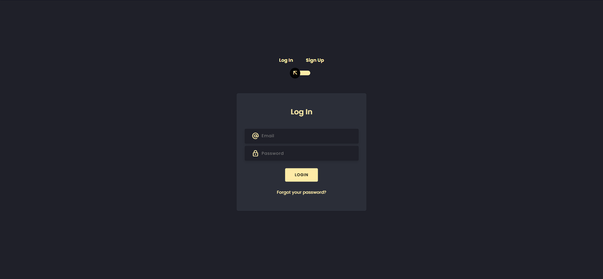
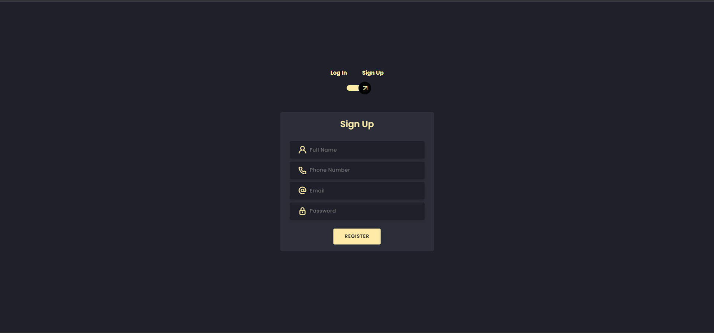

# Login/Signup Form with Wonderful Transitions

This project is a login/signup form with beautiful transitions, designed to enhance the user experience. It provides a seamless and visually appealing way for users to authenticate and create accounts.

## Features

- **Smooth Transitions:** The form utilizes elegant transitions to create a visually pleasing experience for users, enhancing the overall look and feel.
- **Responsive Design:** The form is designed to be responsive and adapt to different screen sizes, ensuring a consistent experience across devices.
- **User-Friendly Validation:** Input fields are validated in real-time, providing users with immediate feedback and reducing errors during login/signup.
- **Secure Authentication:** The form incorporates secure authentication mechanisms, ensuring that user credentials are handled with the utmost care.

## Screenshots

> This screenshot showcases the login page with a stunning transition effect.

> Here's a screenshot of the signup page, highlighting the seamless transition animation.

## Getting Started

To get started with this project, follow the steps below:

1. Clone the repository:

<pre><code>git clone https://github.com/Aarush1137/Transitions_Login_Form.git</code></pre>

2. Open the project in your preferred code editor.

3. Customize the form:
- Modify the HTML and CSS files to suit your specific requirements.
- Add any additional form fields or validation logic as needed.
- Customize the transition effects to align with your design preferences.

4. Test the form:
- Open the project in a web browser.
- Verify that the form functions as expected, with smooth transitions and proper validation.

5. Deployment:
- Upload the project to a web server or hosting platform of your choice.
- Ensure that the necessary server-side code (if any) is properly set up for authentication and data storage.

## Contributing

Contributions are welcome! If you have any ideas or suggestions to improve this project, please feel free to open an issue or submit a pull request.

## License

This project is licensed under the [MIT License](LICENSE).

